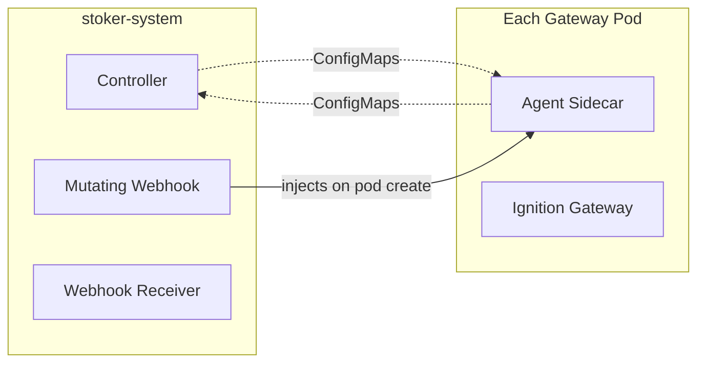
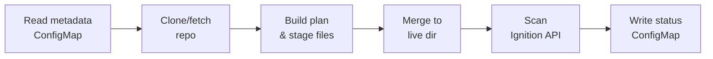

# Architecture

Stoker uses a **controller + agent sidecar** architecture. The controller runs as a Deployment, while each gateway pod gets an agent sidecar injected automatically. There is no shared storage; all communication flows through ConfigMaps.

## Components

Stoker has three components that run inside the controller manager pod, plus the agent sidecar that gets injected into each gateway pod:



### Controller

The controller reconciles `GatewaySync` custom resources. On each reconciliation it:

1. **Resolves the Git ref:** calls `git ls-remote` to translate a branch or tag name to a commit SHA. This requires no clone and no persistent storage.
2. **Discovers gateway pods:** finds pods in the same namespace with the `stoker.io/cr-name` annotation matching this CR.
3. **Writes metadata ConfigMaps:** writes the resolved ref, commit, auth type, mappings, and profile configuration to `stoker-metadata-{crName}`.
4. **Aggregates status:** reads `stoker-status-{crName}` ConfigMaps written by agents and surfaces per-gateway sync status on the CR.

When `rbac.autoBindAgent.enabled` is true (default), the controller also creates a `RoleBinding` in the CR's namespace binding discovered gateway ServiceAccounts to the `stoker-agent` ClusterRole. The binding uses an `ownerReference` pointing to the GatewaySync CR, so it is automatically garbage-collected when the CR is deleted.

The controller uses a custom predicate that triggers reconciliation on spec generation changes _or_ annotation changes (used by the webhook receiver to request immediate syncs).

### Mutating webhook

The webhook intercepts pod creation and injects the agent as a **native sidecar**: an init container with `restartPolicy: Always` (requires Kubernetes 1.28+). Injection requires one condition:

1. **Pod annotation:** `stoker.io/inject: "true"`

Optionally, the `stoker.io/injection=enabled` namespace label can be required by setting `webhook.namespaceSelector.requireLabel=true` in the Helm values. This is useful for regulated environments that need explicit namespace opt-in.

The agent image is resolved in two tiers: CR field `spec.agent.image` > environment variable `DEFAULT_AGENT_IMAGE`.

### Sync agent

The agent runs as a sidecar inside each gateway pod. It operates on a poll loop:



1. **Read:** reads the metadata ConfigMap to get the current ref, commit, mappings, and profile config
2. **Clone:** clones the repo to a local emptyDir at `/repo`
3. **Build plan & stage:** resolves template variables, computes file changes, copies to `/ignition-data/.sync-staging/`
4. **Merge:** moves staged files to the live `/ignition-data/` directory
5. **Clean:** removes orphaned files within managed paths only (won't touch unmanaged directories)
6. **Scan:** calls the Ignition REST API (`/scan/projects` and `/scan/config`) so the gateway reloads without restart
7. **Report:** writes sync results (commit, file counts, errors) to the status ConfigMap

**Commit detection** is dual-track: the metadata ConfigMap is polled every 3 seconds independent of `syncPeriod`, so new commits are detected within 3 seconds of the controller writing them. `syncPeriod` drives a separate fallback timer that fires even when the ConfigMap has not changed.

**Initial sync:** the first cycle skips the scan step and attempts a health check instead (expected to fail; the gateway has not started yet). The agent writes status `Pending`. Status advances to `Synced` after the post-commission re-sync completes.

#### Post-commission re-sync

When deployed as a native sidecar, the agent syncs files before the gateway container starts. Ignition's commissioning process (first boot) overwrites config resources, including `security-properties`, with factory defaults. To restore git-sourced config after commissioning completes, the agent polls the gateway TCP port every 5 seconds using a raw port check rather than the authenticated health endpoint (commissioning may overwrite the security settings that grant API token access). Once the port responds, the agent runs a second full sync+scan cycle. This restores any config that commissioning overwrote and triggers a gateway reload without restart. The `Pending` status from the initial sync clears at this point.

#### Three-layer architecture

The agent is split into three layers to keep concerns separate:

| Layer | Package | Aware of |
|-------|---------|----------|
| **Sync engine** | `internal/syncengine` | File operations only: takes a plan, copies files |
| **Agent orchestrator** | `internal/agent` | Kubernetes (reads ConfigMaps, writes status, emits events) |
| **Ignition client** | `internal/ignition` | Ignition API (scan endpoints, health check, designer sessions) |

The sync engine is intentionally Kubernetes-unaware and Ignition-unaware, making it testable in isolation.

## Communication via ConfigMaps

The controller and agents never communicate directly. All state flows through two ConfigMaps per CR:

| ConfigMap | Writer | Reader | Contents |
|-----------|--------|--------|----------|
| `stoker-metadata-{crName}` | Controller | Agent | Git URL, resolved commit, ref, auth type, paused flag, resolved profiles (mappings, excludes, vars) |
| `stoker-status-{crName}` | Agent | Controller | Per-gateway sync status, synced commit, file counts, errors, change details |

This design means no shared PVC is needed, and agents can run in any pod without special volume configuration beyond the standard `/ignition-data/` mount.

## Webhook receiver

The controller can optionally run an HTTP server on port 9444 that accepts push-event webhooks. The receiver is **disabled by default**. Enable it with `webhookReceiver.enabled: true` in the Helm values.

```
POST /webhook/{namespace}/{crName}
```

It auto-detects the payload format (GitHub, ArgoCD, Kargo, or generic `{"ref": "..."}`) and annotates the GatewaySync CR with the requested ref. The controller's reconciliation predicate picks up the annotation change and triggers an immediate sync.

HMAC signature validation via `X-Hub-Signature-256` is supported when configured.

The receiver runs on every controller replica (`NeedLeaderElection()` returns `false`), so the Service load-balances across all pods and no webhook is dropped if it reaches a non-leader pod.

## Next steps

- [Quickstart](../quickstart.md): get started with a working example
- [Git Authentication](../guides/git-authentication.md): set up auth for private repos
- [Monitoring](../guides/monitoring.md): Prometheus metrics and Grafana dashboards
- [GatewaySync CR Reference](../reference/gatewaysync-cr.md): full spec reference
